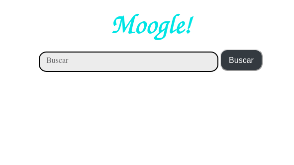

# ***INFORME ESCRITO***



## Estructura :

- vector:
La clase vector va a ser como la celula de nuestro programa, en ella vamos a crear nuestro tipo de dato vector. Para tener de forma organizada nuestra informacion, este tipo de dato creado (clase) va a tener los siguientes datos: `text, title, freq, words, angle, dist, MAX, tf_idf`. 

- BD:
Tenemos un archivo .cs en el cual se realiza el preprocesamiento de los documentos a analizar. Creamos una lista de vectores (que contiene en cada un vector el texto, el titulo, las palabras divididas, la frecuencia y las posiciones donde estan), dos diccionarios `global` y `global2` en los cuales se calculan mediante el metodo times la cantidad de veces que aparecen cada palabra y en cuantos documentos.

- methods:
Aqui se encontraran todos las funciones que utilizaremos para una mejor organizacion *mas adelante mas informacion*.

- Moogle:
Finalmente pero no menos importante en donde manejaremos en flujo de datos por parte del usuario, dado una query utilizando los metodos ya creados apoyandonos en el algebra computamos los angulos que se forman entre la query y los documentos para devolver los mas 'cercanos' *mas adelante mas informacion*

# METHODS:
Para centrarnos en los metodos creados por individual y luego sea mas sencillo explicar el funcionamiento como un todo del moogle.

> Primero las funciones a utilizar seran:
```
read
titles
WORDS
times
dist
edit_distance
findtf_idf
dot
snipet
findsnipet
sum
caldist
```

### READ:
La clase File tiene una funcion implementada *ReadAllText* a la cual pasandole la direccion del archivo (es lo que se envia a la funcion read) y de la forma que se quiere leer devuelve un string 

### TITLES:
Al igual que el anterior metodo la clase Directory nos brinda *GetFiles* para leer el titulo de todos los archivos de la carpeta Content

### WORDS:
De forma resumida vamos a tener unos caracteres no deseados que vamos a eliminar de los textos se normalizara este(bajar a minusculas las mayusculas y quitar las tildes ` con el objetivo de simplificar el trabajo `) luego simplemente se splitea el string y resulta en un arreglo de strings o sea las palabras ya divididas.

### TIMES:
Para llenar nuestros diccionarios recorremos todas las palabras del documento dado y en dependencia d sus aparicionesvamos llenando cada diccionario digase:*frecuencia total, frecuencia por documento, cantidad de documentos en los que aparece ademas se calcula la palabra que mas aparece*.

### DIST:
Simplemente para rellenar una parte de nuestros vectores (las posiciones en que se encuentran cada palabra) bastante trivial.

### EDIT_DISTANCE:
Basandonos en un paradigma de programacion DP  (`Programacion dinamica`), se utiliza para computar de manera eficiente la cantidad minima de cambios necesarios para llevar un string a otro
con una complejidad algoritmica de $N^{2}$. El algoritmo se basa en ir construyendo la matriz de la dp empezando desde 0,0 hasta $n \cdot m$ (`bottom up`), en un principio tenemos dos casos bases no coger nada de la palabra A o no coger nada de la palabra B en ambos casos la cantidad de cambios minimos para llevar un string vacio a otro es trivial o sea quitarlos todos equivalente a la cantidad d caracter de el string no vacio (en caso de que ambos sean vacios sea hacen 0 cambios), luego en caso de que los caracteres a comparar sean iguales no se hace nada en ese paso, si son diferentes tenemos 3 posibilidades la solucion de quitar uno de cada uno o quitar ambos: estos cambios se pueden interpretar como quitar un caracter, agregar uno o cambiar uno en los 3 casos es un cambio. Finalmente en la posicion n,m queda computado el costo final.

### FINDTF_IDF:
Apoyandonos de nuestros conocimientos de algebra vamos a puntuar las palabras de forma racional segun los datos ya calculados, basicamente vamos a calcular el $tfidf$ de cada palabra.
En un principio 

- $tfidf = tf \cdot idf$

- $tf = \frac{freq(wd)}{global(wd)}$

- $idf = \log{2}{(\frac{N}{doc(wd)})}$

```
wd = palabra

N = cantidad de documentos

tf = frecuencia del termino

idf = frecuencia inversa del documento
```
`funciones:`

```
freq = frecuencia en el documento a analizar

global = frecuencia entre todos los documentos 

doc = cantidad de documentos en los que aparece
```
### DOT:
El *producto dot* es un tambien conocido como *producto escalar* es una operacion algebraica que toma dos vectores y retorna un escalar que cumple ciertas caracteristicas, la forma de calcular es muy simple tomemos la suma de todos los $tfidf$ entre ambos vectores y sumemoslos de 1 a 1

- $\sum_{wd=0}^{n}A.tfidf(wd) \cdot B.tfidf(wd)$
```
n = cantidad de palabras 
wd = palabra (indice)
A = primer documento
B = segundo documento
.tfidf = el tfidf de cada documento 
```

### SNIPET:
Dado ciertos criterios de forma arbitraria tomaremos dado un texto y una palabra que por los calculos posteriores consideramos importante, una parte del texto, concatenaremos pedazos del texto en donde aparezca dicha palabra con cierta expansion.

### FINDSNIPET:
Ya ordenados los documentos segun su cercania a la query solo recorriendo una cantidad menor que el total y dadas las palabras mas `importantes` sus plurales y algunas modificaciones de ellas tomemos snipet  **racionales**, ya aqui empleamos los snipets para una mayor exactitud en nuestros resultados, digase el operador *!* (`no`) indica que la palabra a continuacion no puede ser devuelto en los resultados, *^* (`si`) indica que necesariamente en los documentos devueltos tiene que aparecer. Entonces simplente si algun documento incumple con alguna condicion sera eliminado de la lista 

### SUM:
Para llevar a cabo el operador de importancia necesitamos aumentar el valor de las palabras entonces basta con llevar una *sum* y aumentarsela a dichas palabras

### CALDIST:
Exclusivamente para el operador de cercania considerando que ambas palabras deben estar en los documentos a devolver vamos a dar prioridad a los que mas cerca esten. Con una tecnica de `two pointers` barremos de forma eficiente para calcular la distancia minima entre todos los pares.

*two pointers*: como tenemos dos arreglos ordenados y queremos minimizar distancia vamos a ir llevando de forma pareja el recorrido entre dos punteros (`GREEDY`).

# MOOGLE:

Aqui se calculan los datos de la query o sea llena un nuevo vector basandonos en la entrada del usuario, para corregir los errores ortograficos se utiliza el `edit distance` luego si localizan los operadores, tomamos las palabras importantes, para calcular el angulo utilizaremos la siguiente formula:

$\arccos (\frac{C}{A*B})$


```
C = producto dot entre el documento y la query
B = producto dot entre el documento y el documento
A = producto dot entre la query y la query
```

 luego ordenamos segun nuestro criterio de angulo calculamos los snippets y devolvemos el `SearchResult`


